# 3adeny — Let Your CV Pass

<p align="center">
  
</p>

<p align="center">
  <strong>Two documents. One honest score.</strong><br />
  A career automation platform that helps candidates analyze their CV, discover matching roles, find relevant jobs, tailor application documents, and understand exactly where they fit or fall short.
</p>

<p align="center">
  <a href="https://career-automation-frontend.vercel.app">Live Platform</a> •
  <a href="#how-it-works">How It Works</a> •
  <a href="#machine-learning-pipeline">ML Pipeline</a> •
  <a href="#architecture">Architecture</a>
</p>

> **Project context**
> 3adeny is a production-oriented graduation project developed for the **NTI Machine Learning Summer Training Diploma**. The public repository contains only the project documentation.

---

## Table of Contents

- [Overview](#overview)
- [What 3adeny Does](#what-3adeny-does)
- [Product Walkthrough](#product-walkthrough)
    - [Landing Page](#landing-page)
    - [Choose a Workflow](#choose-a-workflow)
    - [Settings and AI Models](#settings-and-ai-models)
    - [Roles Explorer](#roles-explorer)
    - [Matching Listings](#matching-listings)
    - [Tailoring Results](#tailoring-results)
    - [Direct Job Tailor](#direct-job-tailor)
    - [Loading Game](#loading-game)
- [Core Features](#core-features)
- [How It Works](#how-it-works)
    - [1. Explore Roles From My CV](#1-explore-roles-from-my-cv)
    - [2. I Already Have a Job in Mind](#2-i-already-have-a-job-in-mind)
    - [3. Analyze My CV](#3-analyze-my-cv)
- [Machine Learning Pipeline](#machine-learning-pipeline)
- [Job Matching and Similarity](#job-matching-and-similarity)
- [Automated Job Alerts](#automated-job-alerts)
- [Document Generation](#document-generation)
- [Model Development and Data](#model-development-and-data)
- [Architecture](#architecture)
- [Technology Stack](#technology-stack)
- [Important Libraries and Services](#important-libraries-and-services)
- [API-Key Model](#api-key-model)
- [Project Status](#project-status)
- [Limitations and Responsible Use](#limitations-and-responsible-use)
- [Future Improvements](#future-improvements)
- [References](#references)
- [Team / Credits](#team--credits)

---

## Overview

**3adeny** (Arabic: **عدّني** — _“let the CV pass”_) is a career automation platform built around one idea: **a job match should be explainable, not just a black-box percentage**.

The platform processes a candidate's CV, extracts meaningful skills and keywords, creates semantic embeddings, compares the candidate against job roles and listings, and then uses an LLM to generate a detailed analysis and tailored application documents.

The platform currently focuses on **technology roles** and combines classical similarity methods, machine-learning models, vector search, web job scraping, prompt engineering, and browser-side document compilation into one end-to-end workflow.

---

## What 3adeny Does

### Three main entry points

| Workflow                         | Purpose                                                | Main Output                                                                     |
| -------------------------------- | ------------------------------------------------------ | ------------------------------------------------------------------------------- |
| **Explore roles from my CV**     | Start from the CV and discover suitable roles and jobs | Matching titles, relevant job listings, tailored CV, cover letter, match report |
| **I already have a job in mind** | Compare a CV directly against a known job              | Match analysis, tailored CV, cover letter, recommendations                      |
| **Analyze my CV**                | Evaluate the CV itself and discover best-fit roles     | ATS analysis, strengths, improvements, top matching roles, optional tailoring   |

### The core value loop

```text
CV
 │
 ▼
Validation
 │
 ▼
Keyword Extraction ───────────────┐
 │                                │
 ▼                                ▼
CV Embeddings                 Structured Skills
 │                                │
 └──────────────┬─────────────────┘
                ▼
        Semantic + Keyword Matching
                │
                ▼
          Relevant Roles / Jobs
                │
                ▼
       LLM Analysis + Tailoring
                │
        ┌───────┴────────┐
        ▼                ▼
   Tailored CV      Cover Letter
        │                │
        └───────┬────────┘
                ▼
       Browser-side LaTeX → PDF
```

---

# Product Walkthrough

## Landing Page

The landing page communicates the main product promise: compare **what the CV contains** with **what the job requires**, identify the gap, and turn the result into an actionable application.

<p align="center">
  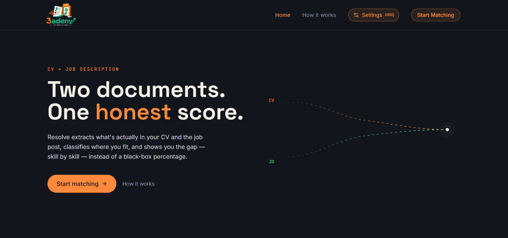
</p>

---

## Choose a Workflow

The Analyze page acts as the main entry point into the platform. Users choose one of three experiences before uploading their CV.

<p align="center">
  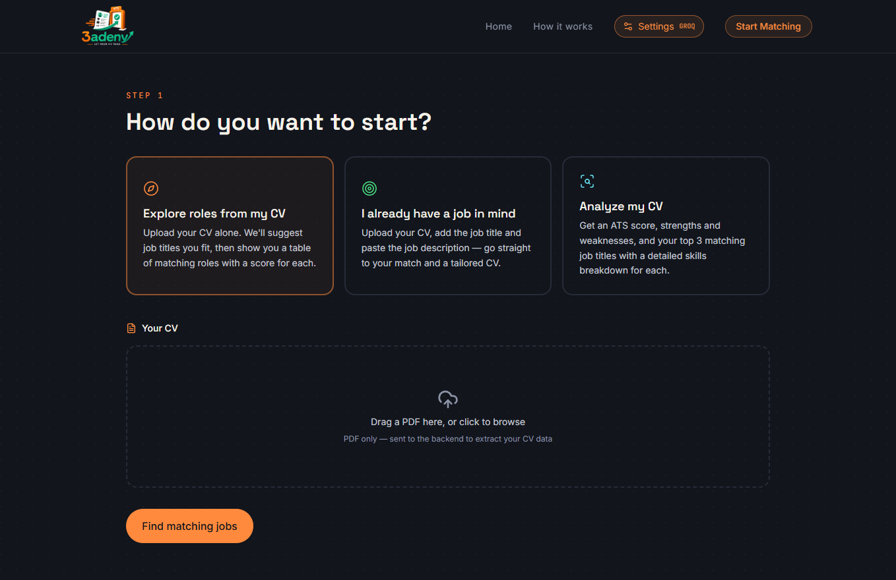
</p>

The three options are:

- **Explore roles from my CV** — discover roles that fit the candidate profile.
- **I already have a job in mind** — directly tailor the CV to a specific job.
- **Analyze my CV** — inspect ATS compatibility and discover suitable roles.

---

## Settings and AI Models

Before any workflow begins, the user selects the LLM provider and supplies its API key. The current providers are:

- **Groq** — fast inference.
- **Gemini** — Google AI.

The application uses the selected provider for LLM-powered analysis and document generation.

<p align="center">
  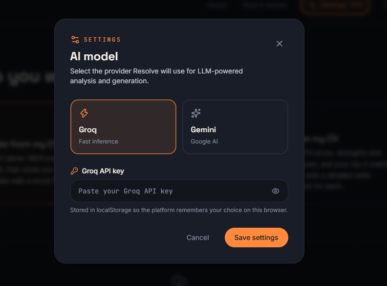
</p>

> **Important:** API keys are user-provided and stored locally in the browser according to the current product design. Never commit real keys, example secrets, or private credentials to the repository.

---

## Roles Explorer

After the CV is processed, 3adeny proposes job titles that fit the candidate profile. The user can select one or more titles and optionally register for email updates.

<p align="center">
  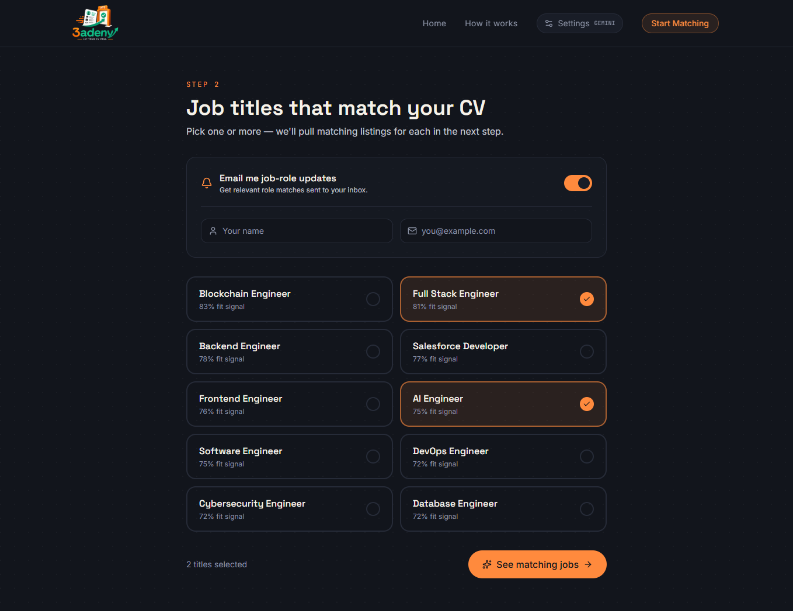
</p>

The role-matching stage uses the processed CV representation, PostgreSQL vector search, cosine similarity, and a refinement stage that combines **Jaccard similarity** and **cosine similarity**.

---

## Matching Listings

Once roles are selected, 3adeny searches for live jobs and ranks them by the similarity between the candidate representation and each job.

<p align="center">
  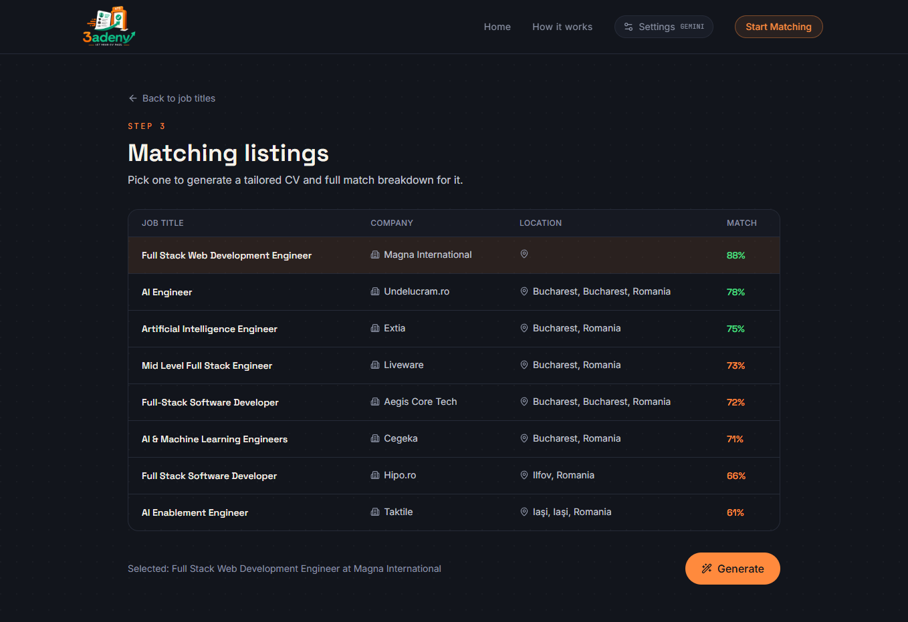
</p>

For each listing, the interface presents the job title, company, location, and match score. The candidate can select a listing and generate a tailored application package.

---

## Tailoring Results

The tailoring result focuses on the difference between the original CV and the tailored CV rather than hiding the process behind one score.

<p align="center">
  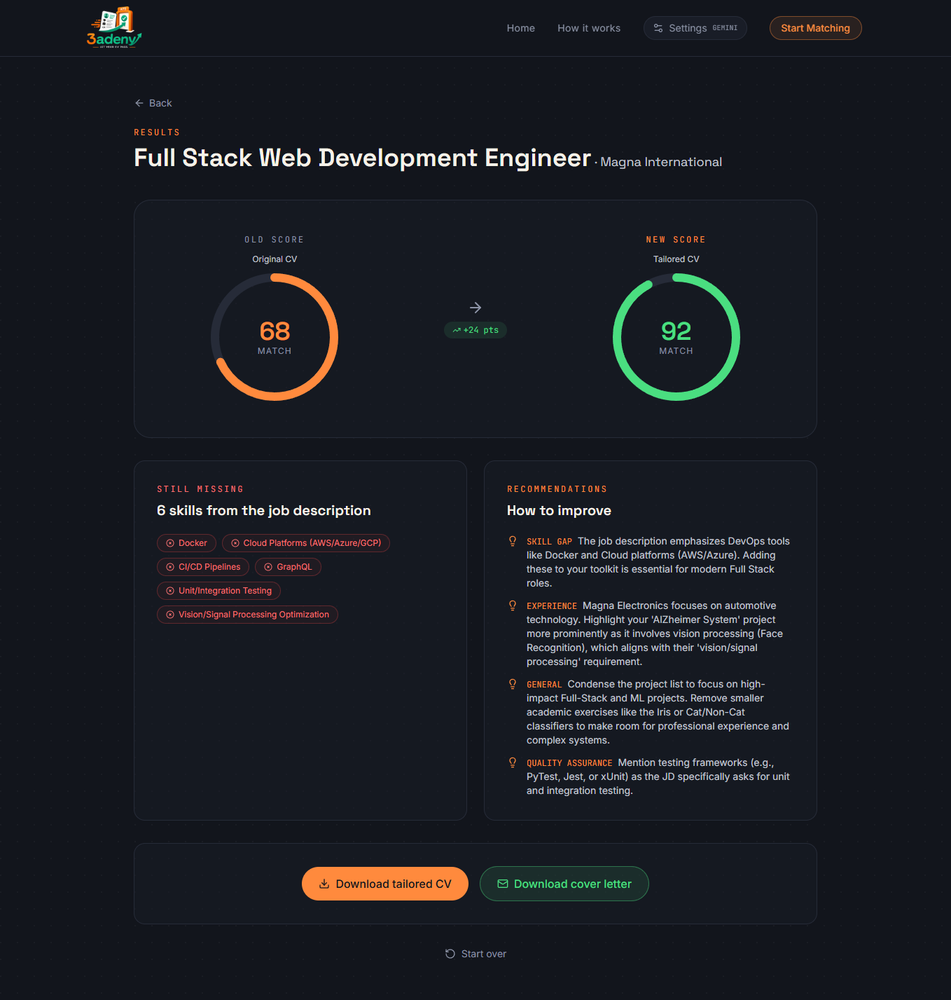
</p>

The generated report includes:

- Original matching score.
- New matching score after tailoring.
- Missing skills from the target job.
- Actionable recommendations covering areas such as skill gaps, experience, general improvements, and quality assurance.
- Downloadable tailored CV.
- Downloadable cover letter.

---

## Direct Job Tailor

Candidates who already have a target job can skip role discovery and provide the job title and description directly.

<p align="center">
  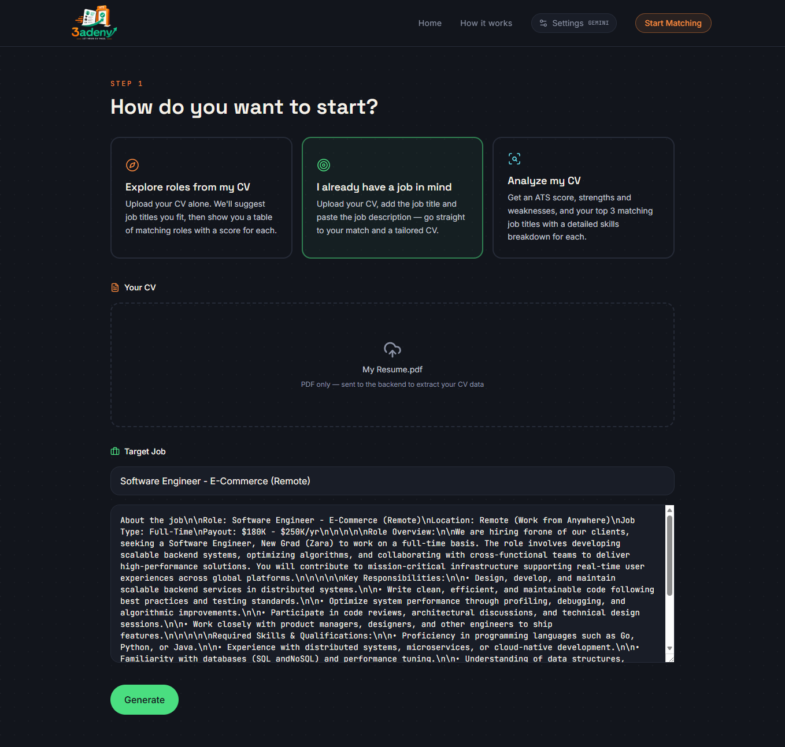
</p>

This workflow reuses the same CV processing stages, then sends the target job and CV information into the LLM-powered analysis and generation stage.

---

## Loading Game

Long-running processing is paired with a small browser game inspired by vertical climbing games. The user can play while the platform is working on the request.

<p align="center">
  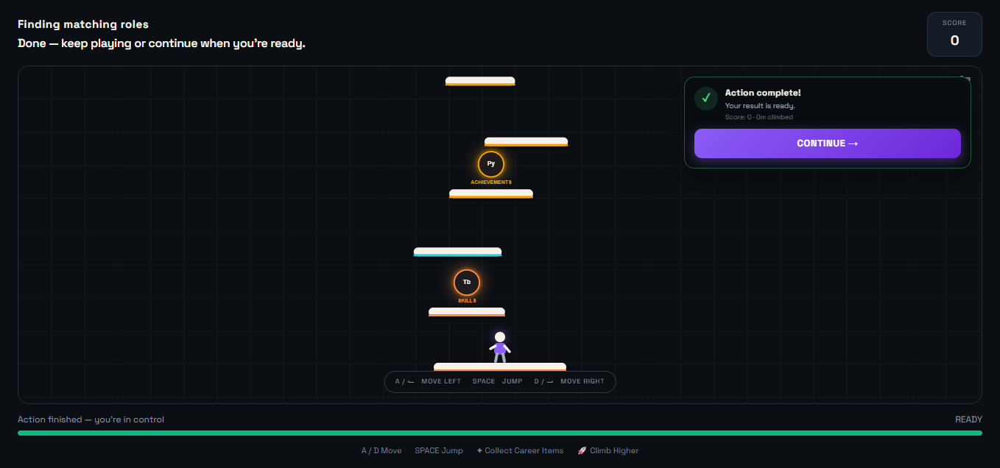
</p>

This is intentionally separate from the ML logic: it is a UX layer designed to make waiting feel interactive rather than passive.

---

# Core Features

### AI-assisted CV and job analysis

- CV validation before processing.
- Skill and keyword extraction with a fine-tuned **RoBERTa-base** model.
- Semantic embeddings with **all-mpnet-base-v2**.
- Vector similarity search using PostgreSQL + pgvector.
- Combined semantic and keyword-based matching.
- ATS-oriented CV analysis.
- Match explanations and missing-skill identification.

### Automated job discovery

- Job-title recommendations based on the candidate CV.
- Live job retrieval using **Python-JobSpy**.
- Location-aware searches using IP-based country detection.
- Similarity-based filtering and ranking.

### Application tailoring

- Target-job-specific CV tailoring.
- Tailored cover-letter generation.
- Detailed recommendations.
- Generated documents returned as LaTeX.
- Client-side LaTeX → PDF compilation using **Siglum WebAssembly**.

### Job alerts

- Users can register selected roles with a name and email.
- A background worker periodically evaluates new jobs.
- Matching opportunities above the defined threshold are emailed to the user.

---

# How It Works

<p align="center">
  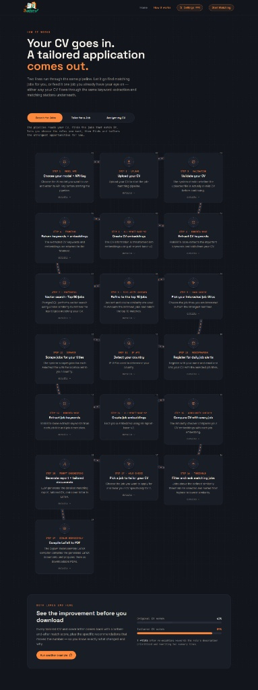
</p>

The screenshot above gives a visual overview of the end-to-end product flow. The sections below explain each branch of the workflow and the corresponding data/ML stages.

## 1. Explore Roles From My CV

**Goal:** Start from a CV, discover promising roles, then find and tailor the strongest live job opportunities.

### End-to-end flow

1. **Choose model + API key** — select Groq or Gemini.
2. **Upload CV** — PDF input becomes the source document.
3. **Validate CV** — reject invalid files before expensive processing.
4. **Extract CV keywords** — RoBERTa-base identifies skills and relevant keywords.
5. **Create CV embeddings** — all-mpnet-base-v2 creates a semantic vector representation.
6. **Return keywords + embeddings** — the processed CV representation is retained by the frontend for later requests.
7. **Vector search** — PostgreSQL retrieves the top **50** job candidates using cosine similarity.
8. **Similarity refinement** — Jaccard + cosine similarity refine the results to the strongest **10** matches.
9. **Choose interested titles** — the user selects roles of interest.
10. **Optional daily-alert registration** — the selected roles, user registration, and CV association are stored.
11. **Detect country** — IP-API determines the candidate's country for location-aware searching.
12. **Scrape jobs** — Python-JobSpy retrieves current jobs for the selected titles and detected country.
13. **Extract job keywords** — RoBERTa-base processes each job title/description.
14. **Create job embeddings** — all-mpnet-base-v2 embeds the job.
15. **Compare CV with each job** — similarity is calculated between candidate and job representations.
16. **Threshold + ranking** — jobs that pass the defined similarity threshold are retained and sorted.
17. **Choose a job** — the candidate selects the listing they want to target.
18. **Generate report + documents** — prompt engineering drives LLM generation of the match report, tailored CV, and cover letter in LaTeX.
19. **Compile documents** — Siglum WebAssembly compiles the LaTeX inside the browser and prepares PDFs for download.

---

## 2. I Already Have a Job in Mind

**Goal:** Skip role discovery and directly compare a CV against one target job.

1. Choose the model + API key.
2. Upload and validate the CV.
3. Extract CV keywords with RoBERTa-base.
4. Create CV embeddings with all-mpnet-base-v2.
5. Return/retain the processed CV information in the frontend.
6. Enter the target job title and job description.
7. Send the target job and CV text to the AI processing stage.
8. Generate the detailed matching report, tailored CV, and cover letter.
9. Compile the generated LaTeX documents to PDFs in the browser.

---

## 3. Analyze My CV

**Goal:** Assess CV quality, identify suitable roles, and optionally start tailoring.

1. Choose the model + API key.
2. Upload and validate the CV.
3. Extract CV keywords with RoBERTa-base.
4. Create CV embeddings with all-mpnet-base-v2.
5. Return/retain the processed CV information in the frontend.
6. Retrieve the top **10** jobs from PostgreSQL using vector search.
7. Refine them to the top **3** using Jaccard + cosine similarity.
8. Use the LLM to evaluate ATS compatibility.
9. Compare the CV against each of the top three jobs.
10. Present matching skills, missing skills, and overall matching scores.
11. Let the candidate choose a target role.
12. Generate the same tailoring report and application documents used by the other workflows.
13. Compile the generated LaTeX to PDF in the browser.

---

# Machine Learning Pipeline

The ML pipeline is built as a sequence of specialized services rather than one monolithic model.

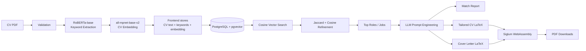

### Why two ML components?

**RoBERTa-base** provides a structured keyword/skill representation, while **all-mpnet-base-v2** provides a semantic representation suitable for vector comparison. This allows the matching system to combine:

- explicit keyword/skill overlap;
- semantic similarity between whole CV/job representations.

This hybrid approach is then refined with Jaccard and cosine similarity instead of relying on a single metric.

---

# Job Matching and Similarity

3adeny uses multiple stages so that an inexpensive broad retrieval can be followed by a more selective comparison.

### Stage 1 — Vector search

The CV embedding is compared with stored job embeddings in PostgreSQL using cosine similarity. In the role-explorer workflow, the first retrieval stage narrows the search to the top **50** candidates.

### Stage 2 — Similarity refinement

The candidate set is refined using both:

- **Cosine similarity** — semantic closeness between embeddings.
- **Jaccard similarity** — overlap between extracted keyword/skill sets.

This produces the strongest shortlist for the next user-facing step.

### Stage 3 — Live-job ranking

For scraped job listings, the CV representation is compared against every retrieved job. A threshold is applied, and only jobs that satisfy the configured similarity requirement remain in the final list.

> The displayed percentage is therefore a product-level matching score derived from the platform's comparison pipeline; it should not be interpreted as a guarantee of interview or hiring probability.

---

# Automated Job Alerts

3adeny includes an asynchronous alerting workflow for users who want new matching jobs without repeatedly opening the platform.

```text
User registration
      │
      ├── Name
      ├── Email
      ├── CV association
      └── Selected job titles
               │
               ▼
        PostgreSQL storage
               │
               ▼
         Cron-Job.org
               │
               ▼
      Background Worker
               │
        ┌──────┴──────┐
        ▼             ▼
   Detect countries   Load selected titles
        │             │
        └──────┬──────┘
               ▼
       Scrape matching jobs
               │
               ▼
     Compare user CV vs job
               │
               ▼
     Threshold / ranking
               │
        match above limit?
          │          │
         yes         no
          │          │
          ▼          └── discard
       Send email
          │
          ├── View LinkedIn listing
          └── Tailor on 3adeny
```

The worker runs separately from the main application so longer processing does not depend on a request lifecycle limited by short serverless execution windows.

---

# Document Generation

The LLM is instructed to produce **valid LaTeX** rather than returning only plain text.

The generated payload for a tailoring workflow contains:

```json
{
    "old_matching_score": 0.0,
    "new_matching_score": 0.0,
    "missing_skills": ["string"],
    "recommendations": [
        {
            "type": "Skill Gap",
            "context": "string"
        }
    ],
    "cv_latex": "valid LaTeX content",
    "cover_letter_latex": "valid LaTeX content"
}
```

### Client-side compilation

Instead of requiring a paid server-side LaTeX compilation service, 3adeny uses **`@siglum/engine`** and its WebAssembly compiler in the browser.

This keeps PDF generation close to the user and reduces backend infrastructure requirements.

The project also includes a frontend workaround for a compatibility issue around **`blake3-wasm`**. The current implementation intentionally triggers Siglum's fallback path so the optional hashing optimization does not block document compilation.

---

# Model Development and Data

## RoBERTa-base keyword extractor

The skill extraction model was trained as a token-classification system using three labels:

```text
O
B-SKILL
I-SKILL
```

### Data sources

The training process combined:

1. A large LinkedIn job-posting dataset from Kaggle with **1M+ rows** in the source dataset.
2. A small CV ATS Scoring dataset from Kaggle that contains cv text and entites from that text.
3. A manually scraped LinkedIn job corpus of approximately **36K rows**, where many old/removed jobs had disappeared from the original source.
4. A Hugging Face resume dataset containing resume text and associated skills.

### Data processing

A substantial preprocessing pipeline was required to:

- clean scraped pages;
- extract useful job fields;
- split text into tokens/words;
- align each token with the corresponding skill label;
- construct the final token-classification dataset.

The preprocessing/labeling validation was reported at **above 90% accuracy**, while model quality was substantially harder to optimize.

### Tech-focused MVP dataset

Because initial training metrics were not strong enough on the broader data, the project narrowed the MVP to **technology jobs** and filtered the dataset to approximately **4,500 rows** with relevant technical keywords.

Hyperparameters were tuned with **Optuna**, with special emphasis on **recall** so the extractor would be less likely to miss important skills.

After threshold optimization, the highest reported recall reached approximately **69%** on the resulting setup.

> The reported 69% figure is a project result for the final optimized setup, not a claim that every possible skill or job is extracted correctly.

---

## Job-title dataset

A second Kaggle LinkedIn dataset containing job titles and skills was filtered to retain technology-oriented titles. Additional preprocessing and LLM-assisted enrichment increased the role catalog to **60+ technology job titles** used for role matching and downstream job discovery.

---

## Job retrieval

For live predictions, the platform uses **Python-JobSpy** to retrieve jobs from sources such as:

- LinkedIn
- Indeed

The search location is derived from the user's country using **IP-API** geolocation.

---

# Architecture

3adeny follows a **microservice architecture** to separate the web application, API/business logic, ML inference, and asynchronous background workloads.

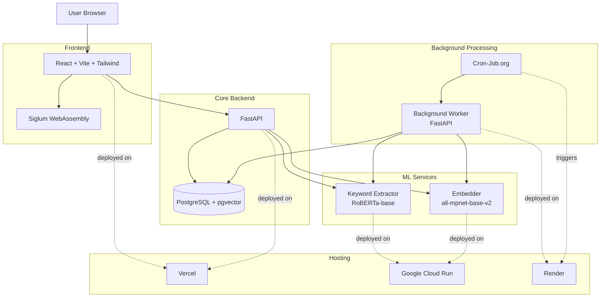

### Why split the services?

The model services are isolated from the main web applications because loading ML models inside serverless applications can cause RAM pressure, cold-start issues, and platform/runtime limitations. Hosting the keyword extractor and embedder separately on **Google Cloud Run** keeps the inference workloads independent from the main frontend/backend deployments.

The background worker is hosted separately on **Render** so the scheduled process is not constrained by short serverless request windows.

---

# Technology Stack

| Layer                 | Technology                            |
| --------------------- | ------------------------------------- |
| Frontend              | React, Vite, Tailwind CSS             |
| Backend API           | FastAPI                               |
| Database              | PostgreSQL                            |
| Vector Search         | pgvector                              |
| Skill Extraction      | RoBERTa-base (fine-tuned)             |
| Semantic Embeddings   | all-mpnet-base-v2                     |
| LLM Providers         | Groq, Gemini                          |
| Job Scraping          | Python-JobSpy                         |
| Geolocation           | IP-API                                |
| Document Generation   | LLM + prompt engineering              |
| LaTeX Compilation     | Siglum WebAssembly / `@siglum/engine` |
| Background Processing | FastAPI background worker             |
| Scheduling            | Cron-Job.org                          |
| Frontend Hosting      | Vercel                                |
| Backend Hosting       | Vercel                                |
| ML Hosting            | Google Cloud Run                      |
| Worker Hosting        | Render                                |
| Architecture          | Microservices                         |

---

# Important Libraries and Services

## `@siglum/engine`

Used for client-side LaTeX compilation. This avoids requiring a paid server-side compiler for PDF generation.

**Package:** `@siglum/engine`

## Python-JobSpy

Used to simplify job collection from multiple sources such as LinkedIn and Indeed.

## Hugging Face models

Both the fine-tuned RoBERTa-base model and the embedding model are hosted on Hugging Face for consistency across services.

---

# API-Key Model

The current application intentionally requires the user to configure an LLM provider before running AI-dependent workflows.

### Supported providers

| Provider   | Purpose                             |
| ---------- | ----------------------------------- |
| **Groq**   | LLM-powered analysis and generation |
| **Gemini** | LLM-powered analysis and generation |

The selected provider and API key are used when the workflow reaches the LLM stages.

This model lets the platform avoid shipping a shared provider secret to every user and lets the candidate choose the provider they want to use.

---

# Project Status

**Current focus:** production-oriented MVP for technology roles.

### Implemented capabilities

- [x] CV validation
- [x] Skill/keyword extraction
- [x] CV embeddings
- [x] Vector-based role/job matching
- [x] Jaccard + cosine similarity refinement
- [x] Live job scraping
- [x] Country-aware job search
- [x] ATS-oriented CV analysis
- [x] LLM-generated tailored CV
- [x] LLM-generated cover letter
- [x] Detailed match report
- [x] Browser-side LaTeX compilation
- [x] Optional daily job alerts
- [x] Background worker
- [x] Processing mini-game

---

# Limitations and Responsible Use

3adeny is a machine-learning-assisted career tool, not a hiring decision system.

### Current limitations

- The MVP is intentionally focused on technology-oriented jobs.
- Skill extraction is not perfect; the optimized model reached approximately 69% recall in the reported setup.
- Similarity scores are indicators of textual/semantic fit, not guarantees of suitability or hiring outcomes.
- Job availability depends on external job sources and scraping success.
- ATS analysis is LLM-assisted and should be treated as guidance rather than an authoritative ATS vendor score.
- LLM-generated CVs and cover letters should be reviewed by the candidate before submission.

### Responsible use

Candidates should keep all generated claims truthful. Tailoring should improve presentation and relevance, **not invent skills, employment, education, certifications, or achievements**.

---

# Future Improvements

The architecture is designed to support expansion beyond the current MVP.

### Product

- Expand beyond technology roles.
- Add richer filtering for remote/on-site/hybrid and seniority.
- Improve saved-job and application tracking.
- Add more notification channels.
- Provide candidate history and previous tailoring comparisons.

### Machine learning

- Increase the size and diversity of the labeled skill-extraction corpus.
- Improve recall for multi-token skills.
- Evaluate the extractor on a held-out benchmark rather than only tuning on the project dataset.
- Calibrate similarity scores so that displayed percentages better reflect observed relevance.
- Evaluate alternative embedding models and hybrid ranking strategies.

### Infrastructure

- Add centralized observability across all microservices.
- Introduce message queues for long-running job processing.
- Add retries, dead-letter handling, and idempotency to the alert worker.
- Add automated model/version tracking.
- Add integration and load testing for the full pipeline.

---

# References

### Datasets

- **Hugging Face Resumes Dataset** — resume text and associated skills.
- **ATS Scoring Dataset** — Kaggle dataset used as a source for CV text and keywords.
  https://www.kaggle.com/datasets/mgmitesh/ats-scoring-dataset
- **1.3M LinkedIn Jobs and Skills 2024** — Kaggle dataset used as a source for LinkedIn job and skill information.  
  https://www.kaggle.com/datasets/asaniczka/1-3m-linkedin-jobs-and-skills-2024?select=job_skills.csv
- **LinkedIn Data Engineer Job Postings** — Kaggle dataset used for job-title/skill processing.  
  https://www.kaggle.com/datasets/asaniczka/linkedin-data-engineer-job-postings

### Libraries / services

- Hugging Face — https://huggingface.co/
- Siglum Engine — https://www.npmjs.com/package/@siglum/engine
- Python-JobSpy — https://github.com/speedyapply/JobSpy
- Cron-Job.org — https://cron-job.org/
- Google Cloud Run — https://cloud.google.com/run
- Vercel — https://vercel.com/
- Render — https://render.com/

---

# Team / Credits

| Member             |                          Portfolio                          |                          LinkedIn                          |                    GitHub                     |                  Email                   |
| :----------------- | :---------------------------------------------------------: | :--------------------------------------------------------: | :-------------------------------------------: | :--------------------------------------: |
| **Mazen Mohsen**   |        [Portfolio](https://mazen4dev.cu-portal.com)         |   [LinkedIn](https://www.linkedin.com/in/mazenmohsen15)    |    [GitHub](https://github.com/Mazen91235)    | [Email](mailto:mazenmohsen24@gmail.com)  |
| **Renad Amr**      |     [Portfolio](https://renad29amr.github.io/portfolio)     |     [LinkedIn](https://www.linkedin.com/in/renad-amr)      |    [GitHub](https://github.com/renad29amr)    |  [Email](mailto:renadamr.bls@gmail.com)  |
| **Nancy Ashraf**   | [Portfolio](https://nancy-ashraf-george-e4px8l6.gamma.site) |    [LinkedIn](https://www.linkedin.com/in/nancyashraff)    |   [GitHub](https://github.com/nancyashraff)   | [Email](mailto:Nancyashraf834@gmail.com) |
| **Youssef Hamada** | [Portfolio](https://www.linkedin.com/in/youssefhamadawahba) | [LinkedIn](https://www.linkedin.com/in/youssefhamadawahba) | [GitHub](https://github.com/YoussefHamada101) |  [Email](mailto:youssefw333@gmail.com)   |

---

### Acknowledgments

We sincerely thank the **National Telecommunication Institute (NTI)** for organizing the **Machine Learning Summer Training Diploma**, which provided the opportunity, guidance, and learning environment that made this project possible.

We also extend our appreciation to our instructors (Eng. Abdelrahman Bakeer, Eng. Nancy Ahmed) for their continuous support, technical guidance, and valuable feedback throughout the development of **3adeny**.

---

## Screenshot Asset Map

The README intentionally places the supplied screenshots near the feature they demonstrate:

| Asset               | README section                         | Purpose                             |
| ------------------- | -------------------------------------- | ----------------------------------- |
| `landing.png`       | Landing Page                           | Product positioning / hero          |
| `start-explore.png` | Choose a Workflow                      | Three main entry points             |
| `settings.png`      | Settings and AI Models                 | Groq / Gemini configuration         |
| `how-it-works.png`  | Product Walkthrough (optional gallery) | Full pipeline overview              |
| `job-titles.png`    | Roles Explorer                         | Recommended roles + email alerts    |
| `job-listings.png`  | Matching Listings                      | Ranked live jobs                    |
| `results.png`       | Tailoring Results                      | Score improvement + recommendations |
| `direct-tailor.png` | Direct Job Tailor                      | Direct target-job workflow          |
| `loading-game.png`  | Loading Game                           | Interactive processing state        |

---

<p align="center">
  <strong>3adeny — Let your CV pass.</strong><br />
  <sub>From CV → matching → insight → tailored application.</sub>
</p>
